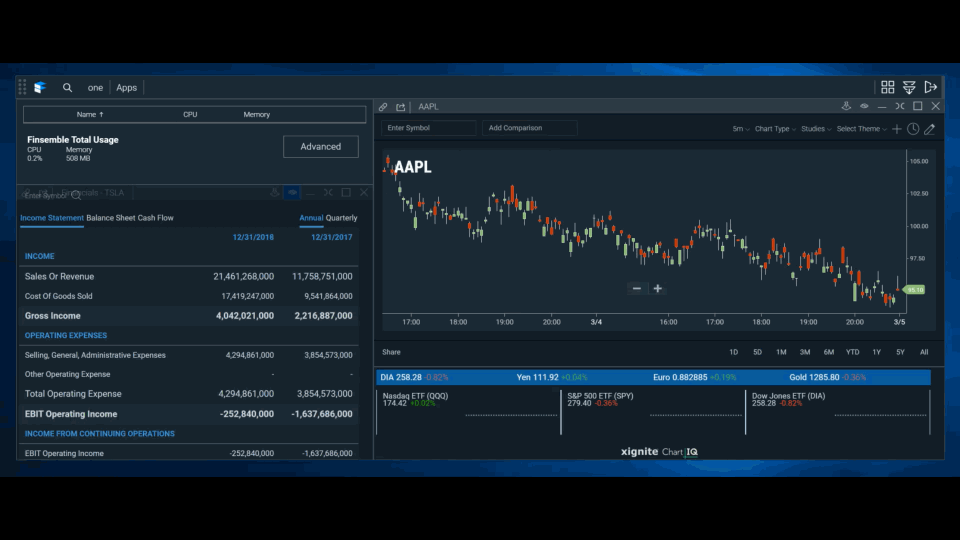

## WindowTitleBar - Autohiding Window Chrome edition

### Overview
The windowTitleBar is a component that's injected into every component. However, large numbers of titlebars on the screen can create visual noise within components thats are not moved very often. To recover screen realestate and reduce visual noise, this version of the window titlebar supports an additional button and configuration for automatically hiding the window chrome (titlebar) when the window is not being interacted with by the user's mouse.


### Configuration ###
Whether the autohide pin shows or not depends first on the global setting (`finsemble["Window Manager"].autoHideIcon`) and then
on the specific setting for this component (`foreign.components["Widow Manager"].autoHideIcon`). Hence, it can be enabled for all windows if desired or enabled/disabled for individual components as needed. When enabled the space occupied by the title can also be recovered, allowing for a more compact component layout if desired.

To enable with default settings, set the indicated config elements to `true`. The default settings are:
```{
	"defaultSetting": false,  //Do not enable auto-hiding by default - require user to click the pin
	"timeout": 2000,          //Hide window chrome 2000 ms (2 seconds) after the last interaction
	"resetMargin": true       //Reset the <BODY> tag's margin-top to 0px when enabled 
	                          //N.B. margin-top is usually added automatically on header injection
							  //N.B. margin-top is restored to default after autohide is disabled

};
```

To customize behavior for all windows, use the following form in _/configs/application/config.json_:
```
...
"Window Manager": {
	...
	"autoHideIcon": {
		"defaultSetting": true,
		"timeout": 2000,
		"resetMargin": true
	},
	...
},
...
```
To disable the autohide icon for all components set `autoHideIcon` to `false`.

To customize behavior for a particular component, use the following form in the component configuration (often found in _/configs/application/components.json_):
```
"<component name>": {
	"window": { ... },
	"component": { ... },
	"foreign": {
		...
		"components": {
			...
			"Window Manager": {
				...
				"autoHideIcon": {
					"defaultSetting": true,
					"timeout": 2000,
					"resetMargin": true
				}
			},
			...
		}
	}
},
```
To disable the autohide icon for this specific components set `autoHideIcon` to `false`.
