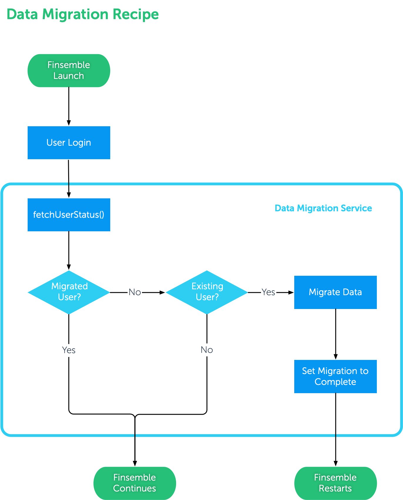

[](https://documentation.chartiq.com/finsemble/)

# Finsemble Recipe: Data Migration

In some cases, users have been deployed using Chromium's IndexedDB as the default storage adapter, as this is the default for Finsemble's seed project. For more sustainable usage across multiple machines and centralized handling of data, migration to a remote database is often times needed.

In other cases, migration from one remote datastore to another is needed. This recipe, with appropriate modifications, can handle both cases.

For the purposes of this example, the **current** datasource will be **IndexedDB**. _N.b._: this recipe does not utilize a remote data adapter. It utilizes LocalStorage as a mimic for data migration. It is up to you to create the storage adapter you'd like to use and register it by comparing the recipe to your extant code.

## Ingredients

This recipe contains a service and a component to assist in setting up a migration workflow:

### Service: `datamigration`

**Files**:
```
└── datamigration
    ├── README.md (this file)
    ├── config.json
    ├── datamigration.html
    └── datamigrationService.js
```

**Flowchart**




1. If the user has no data (is a new user) or has already been migrated, the Migration Assistant component should not spawn.
1. If the user has data in the current storage adapter, a simple message displays with warning copy and action buttons.
1. Upon completion, Finsemble should be restarted.


### Migration Assistant Component: `migration`

The Migration Assistant component is a basic HTML5 component designed to communicate to the user the state of their data. This component is a sample and is designed to be customized to your needs.   

```
└── migration
    ├── config.json
    ├── finsemble.webpack.json
    ├── migration.css
    ├── migration.html
    └── migration.js
```

## Directions

1. Place the `src/services/datamigration` directory from this branch in your Finsemble `src/services` directory.
1. Copy the `src/components/migration` directory from this branch to your Finsemble `src/components` directory.
1. Modify `configs/application/config.json:servicesConfig.storage` topics to use `LocalStorageAdapter` or your custom storage adapter that you've already created as per [the documentation](https://documentation.chartiq.com/finsemble/tutorial-storingData.html).
1. In the  `finsemble.importConfig` array of your [manifest](https://documentation.chartiq.com/finsemble/tutorial-Configuration.html), include references to the component and service `config.json`:
    
    ```json
    "importConfig": [
        ...
        "$applicationRoot/components/migration/config.json",
        "$applicationRoot/services/datamigration/config.json",
        ...
    ],
    ```
1. Install if needed and start Finsemble: `npm install; npm run dev`.
1. After the user is authenticated, the Migration Assistant component will or will not display as per the logic from the service, as above.

